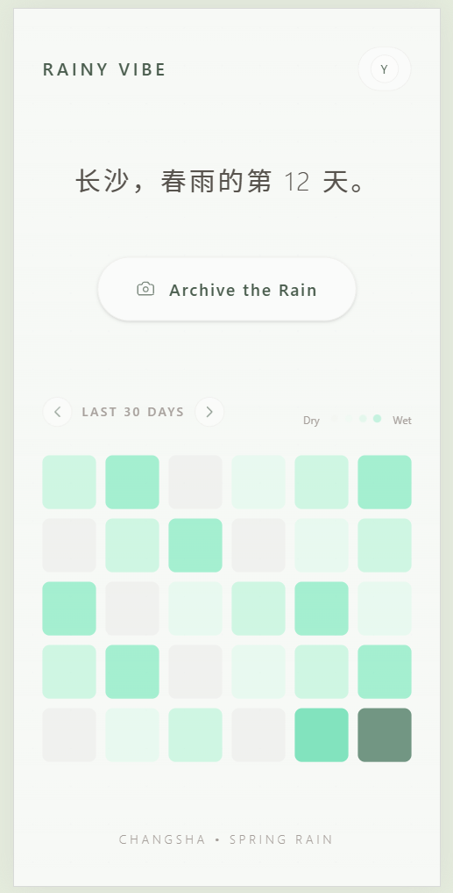
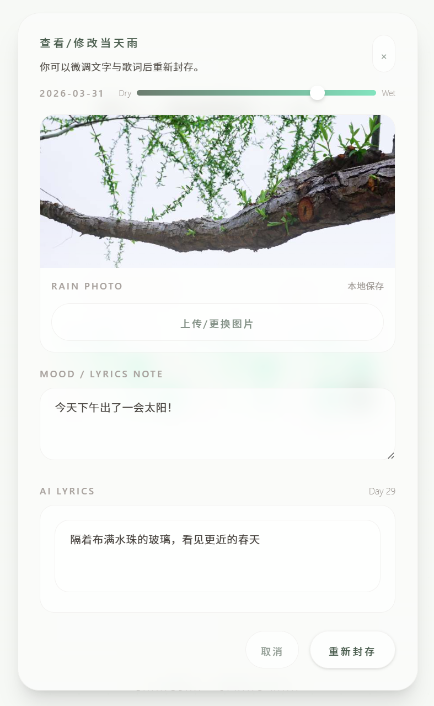

# Archive the Rain 🌧️ (雨水色谱)

> A minimalist, AI-powered web app for archiving rainy days, moods, and emotional humidity.
> 一个基于 AI 与纯前端本地存储的极简雨天收集册与情绪贡献图。

## 📖 About The Project / 项目简介

**Archive the Rain** is a personal vibe-coding project born from a continuous rainy season. It serves as an "emotional dehumidifier", allowing users to capture rain photos, select their emotional humidity through a smooth color gradient, and build a unique GitHub-style contribution graph out of their rainy days. The project leverages AI to intelligently match lyrics to uploaded rain photos, creating a deeply personalized archiving experience.

这是一个诞生于漫长雨季的个人前端练手项目。它不仅是一个天气记录工具，更是一个“情感除湿机”。用户可以通过色彩渐变滑块记录当天的“情绪湿度”，并将每一次下雨，变成主页上一面独一无二的雨天贡献图（Rain Contribution Graph）。项目利用 AI 技术，根据用户上传的雨景照片智能匹配或生成相应的音乐歌词，打造深度个性化的存档体验。

### ✨ Key Features / 核心功能

- **📸 Rain Capture (捕捉雨水):** Upload or take a photo of the rain and write down your thoughts. (支持上传雨景图片与随笔记录)
- **🎚️ Humidity Slider (情绪湿度):** A custom color slider transitioning from dry gray to melancholy green, mapping your mood to specific hex codes. (拖动色彩滑块，将情绪具象化为特定的色卡)
- **🎵 Smart AI Lyrics (智能 AI 歌词):** _(Incoming Upgrade)_ Intelligently generates or matches poetic lyrics based on the visual content and mood of the uploaded photo using Vision LLM APIs. (即将升级：利用多模态大模型 API，根据上传图片的视觉内容与氛围，智能生成或匹配对应的音乐歌词)
- **🟩 Rain Contribution Graph (雨水日历墙):** Visualizes your records mimicking GitHub's contribution graph. (类似 GitHub 绿墙的雨天专属色块网格)
- **🔒 Privacy First (本地私密):** 100% serverless currently. All data (images, texts, dates) is securely saved in the browser's `localStorage`. (纯前端单机版，所有数据通过 LocalStorage 存储在本地，绝对保护隐私)

## 💻 Tech Stack / 技术栈

- **Framework:** React 18 + Vite
- **Styling:** Tailwind CSS (Focusing on glassmorphism and minimalist UI)
- **State Management:** React Hooks
- **Storage:** Web Storage API (`localStorage`)
- **_(Future Addition)_ AI/ML:** OpenAI (GPT-4 Vision) / Claude APIs via serverless functions.

## 🚀 Getting Started / 本地运行

1. Clone the repository:
   ```bash
   git clone [https://github.com/yaraxiong/nature-palette.git](https://github.com/yaraxiong/nature-palette.git)
   ```
2. Install dependencies:
   npm install

3. Run the development server:
   npm run dev

## 🗺️ Roadmap / 未来迭代计划

- Evolution to "Nature Palette🌿" (多主题自然更迭): Expand from the current "Rainy Mode" to a full seasonal and nature suite. (从单一的“雨天模式”扩展为包含四季的“自然调色盘”：加入夏日暖阳黄☀️、秋叶焦糖色🍂、冬雪冰蓝色❄️等主题切换引擎。)

- AI Vision Integration (AI 视觉引擎接入): Implement backend image analysis via Supabase Edge Functions to fully realize the Smart AI Lyrics feature securely. (实现后端图片分析，基于照片内容智能匹配歌词)

- Supabase Integration: Migrate from localStorage to a cloud database with user authentication. (接入 Supabase 实现在线数据库与云端同步。)

- Canvas Export: Allow users to generate a beautiful long image of their record for social sharing. (利用 Canvas 一键生成极简情绪画报。)

<br>

<div align="center">
  <table style="border: none; background: none; margin: 0 auto;">
    <tr>
      <td style="border: none; text-align: center; width: 350px;">
        <p align="center">
          <b>🏠 Main Screen (首页展示)</b><br>
          
        </p>
      </td>
      <td style="border: none; text-align: center; width: 350px;">
        <p align="center">
          <b>📝 Record Popup (记录弹窗)</b><br>
          
        </p>
      </td>
    </tr>
  </table>
</div>
<br>
